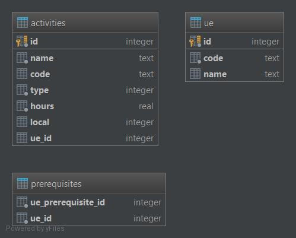

# Gestion des unités d'enseignement
Service responsable de la gestion des unités d'enseignement (UE).

## GestionUE
Cette application, _GestionUE_, permet de gérer les unités d'enseignement via une interface graphique. L'application peut créer, modifier et supprimer des unités d'enseignement. En outre, chaque unité d'enseignement possède une liste d'activités et/ou des prérequis.

L'application offre également une **RESTful API** pour récupérer, ajouter, modifier et supprimer des unités d'enseignement et des activités.

## Langages de programmation
Le front-end de l'application est programmé en HTML, CSS et jQuery tandis que le back-end utilise le framework _Nodejs_ pour sa simplicité et sa rapidité. 

## Structure du projet
Le projet _Nodejs_ est divisé en différents fichiers et dossiers:
- **manager/**: Ce dossier contient deux fichiers: *UEManager* et *ActivityManager*. Ces fichiers offrent des méthodes implémentant la communication avec la base de données. De ce fait, pour récupérer, ajouter, modifier ou supprimer une entrée dans la base de données, il suffit d'appeler la méthode correspondante.
- **public/**: contient tous les fichiers statiques tels que les scripts Javascript ou encore les feuilles de style.
- **routes/**: définit les routes disponibles de l'application et la logique de ces-dernières.
- **views/**: fournit l'ensemble des vues disponibles qui seront utilisées par les routes.
- **app.js**: point d'entrée du serveur _Nodejs_. Ce fichier initialise et prépare toute l'application.
- **package.json**: contient l'ensemble des dépendances du projet.

## Structure de la base de données
J'ai décidé d'utiliser une base de données rationnelle, _SQLite_, accessible par le langage SQL. Elle a une particularité par rapport aux autres bases de données tels que MySQL ou PostgreSQL. En effet, la base de données est stockée sur un fichier indépendant de l'application. Cela permet de pouvoir travailler facilement depuis n'importe quel ordinateur (sans hérberger la base de données en ligne)en gardant les données intactes (suite à un pull par exemple).

La structure de la base de données est montrée sur la figure ci-dessous. Comme on peut le voir, la base de données contient 3 tables:
1. **ue**: contient l'ensemble des unités d'enseignement
1. **activities**: contient l'ensemble des activités liés à une unité d'enseignement grâce à l'attribut _ue_id_
1. **prerequisites**: contient l'ensemble des prérequis des unités d'enseignement. Les prérequis sont liés aux unités d'enseignement grâce au champ _ue_id_.

## Interface graphique
TODO

## RESTful API
Comme expliqué ci-dessus, l'application offre une RESTful API disponible à l'adresse _/api_. Ci-dessous sont détaillés l'ensemble des requêtes possibles:

- [GET] /api/ue: renvoie un tableau contenant l'ensemble des unités d'enseignement.
- [GET] /api/ue/_:id_: récupère les informations d'une unité d'enseignement en fonction de l'identifiant _id_.
- [PUT] /api/ue/_:id_: modifie les données d'une unité d'enseignement.
- [POST] /api/ue: crée une nouvelle unité d'enseignement.
- [DELETE] /api/ue/_:id_: supprime l'unité d'enseignement ayant comme identifiant _id_.

- [GET] /api/activities: récupère toutes les activités.
- [GET] /api/activities/_:id_: recupère l'activité ayant comme identifiant _id_.
- [PUT] /api/activities/_:id_: modifie l'activité ayant comme identifiant _id_.
- [POST] /api/activities: crée une nouvelle activité
- [DELETE] /api/activities/_:id__: supprime l'activité ayant comme identifiant _id_.

Toutes les routes de l'API sont définies dans le dossier _/routes/api/_.

## Conclusion
L'application offre les fonctionnalités suivantes:
- Interface graphique permettant une gestion complète des unités d'enseignement, des prérequis et des activités.
- RESTful API qui permet de communiquer avec le serveur depuis d'autres applications/services externes.
- SQLite qui sauvegarde de manière permanente les données.

L'application possède quelques défauts qui peuvent être améliorés. Les pistes d'amélioration sont indiquées ci-dessous:
- Améliorer la sécurité de l'application. En effet, pour l'instant seulement certaines données sont vérifiés avant de le sauvegarder.
- Lors de la création d'une activité, il est possible d'entrer un local de prédilection. Ce champ est un champ texte, l'utilisateur peut ainsi entrer n'importe quel local même inexistant. L'idée serait d'aller récupérer la liste des locaux disponibles depuis un service externe.

Pour finir, l'application est entièrement fonctionnelle.
